# <!-- md:samp ClientCacheBlobStatusPacket -->

> 文档版本：r/20_u7 协议版本：662

<!-- md:samp ClientCacheBlobStatusPacket -->数据包，数字ID是`135`。

## 结构

```dot
digraph ClientCacheBlobStatusPacket {
	graph [rankdir=LR];
	{
		graph [rank=max];
		2	[comment="name: \"unsigned varint\", typeName: \"\", id: 2, branchId: 0, recurseId: -1, attributes: 512, notes: \"\"",
			label="unsigned varint"];
		4	[comment="name: \"unsigned varint\", typeName: \"\", id: 4, branchId: 0, recurseId: -1, attributes: 512, notes: \"\"",
			label="unsigned varint"];
		8	[comment="name: \"unsigned int64\", typeName: \"\", id: 8, branchId: 0, recurseId: -1, attributes: 512, notes: \"\"",
			label="unsigned int64"];
		12	[comment="name: \"unsigned int64\", typeName: \"\", id: 12, branchId: 0, recurseId: -1, attributes: 512, notes: \"\"",
			label="unsigned int64"];
	}
	0	[comment="name: \"ClientCacheBlobStatusPacket\", typeName: \"\", id: 0, branchId: 135, recurseId: -1, attributes: 0, notes: \"\"",
		label=ClientCacheBlobStatusPacket];
	1	[comment="name: \"Number of missing blobs\", typeName: \"\", id: 1, branchId: 0, recurseId: -1, attributes: 0, notes: \"\"",
		label="Number of missing blobs"];
	0 -> 1;
	3	[comment="name: \"Number of obtained blobs\", typeName: \"\", id: 3, branchId: 0, recurseId: -1, attributes: 0, notes: \"\"",
		label="Number of obtained blobs"];
	0 -> 3;
	5	[comment="name: \"Missing Blobs\", typeName: \"\", id: 5, branchId: 0, recurseId: -1, attributes: 8, notes: \"\"",
		label="Missing Blobs"];
	0 -> 5;
	9	[comment="name: \"Obtained Blobs\", typeName: \"\", id: 9, branchId: 0, recurseId: -1, attributes: 8, notes: \"\"",
		label="Obtained Blobs"];
	0 -> 9;
	1 -> 2;
	3 -> 4;
	6	[comment="name: \"example element\", typeName: \"\", id: 6, branchId: 0, recurseId: -1, attributes: 16, notes: \"\"",
		label="example element",
		style=dotted];
	5 -> 6;
	7	[comment="name: \"Blob Id\", typeName: \"\", id: 7, branchId: 0, recurseId: -1, attributes: 0, notes: \"\"",
		label="Blob Id"];
	6 -> 7;
	7 -> 8;
	10	[comment="name: \"example element\", typeName: \"\", id: 10, branchId: 0, recurseId: -1, attributes: 16, notes: \"\"",
		label="example element",
		style=dotted];
	9 -> 10;
	11	[comment="name: \"Blob Id\", typeName: \"\", id: 11, branchId: 0, recurseId: -1, attributes: 0, notes: \"\"",
		label="Blob Id"];
	10 -> 11;
	11 -> 12;
}

```

## 字段

/// define
ClientCacheBlobStatusPacket

Number of missing blobs：<!-- md:samp unsigned varint -->

- 类型：unsigned varint。

Number of obtained blobs：<!-- md:samp unsigned varint -->

- 类型：unsigned varint。

Missing Blobs

Missing Blobs的示例元素

Blob Id：<!-- md:samp unsigned int64 -->

- 类型：unsigned int64。

Obtained Blobs

Obtained Blobs的示例元素

///
