# <!-- md:samp ClientboundMapItemDataPacket -->

> 文档版本：r/20_u7 协议版本：662

<!-- md:samp ClientboundMapItemDataPacket -->数据包，数字ID是`67`。

## 结构

```dot
digraph ClientboundMapItemDataPacket {
	graph [rankdir=LR];
	{
		graph [rank=max];
		2	[comment="name: \"ActorUniqueID\", typeName: \"\", id: 2, branchId: 0, recurseId: -1, attributes: 512, notes: \"\"",
			label=ActorUniqueID];
		4	[comment="name: \"unsigned varint\", typeName: \"\", id: 4, branchId: 0, recurseId: -1, attributes: 512, notes: \"\"",
			label="unsigned varint"];
		6	[comment="name: \"byte\", typeName: \"\", id: 6, branchId: 0, recurseId: -1, attributes: 512, notes: \"\"",
			label=byte];
		8	[comment="name: \"bool\", typeName: \"\", id: 8, branchId: 0, recurseId: -1, attributes: 512, notes: \"\"",
			label=bool];
		10	[comment="name: \"BlockPos\", typeName: \"\", id: 10, branchId: 0, recurseId: -1, attributes: 512, notes: \"\"",
			label=BlockPos];
		15	[comment="name: \"unsigned varint\", typeName: \"\", id: 15, branchId: 0, recurseId: -1, attributes: 512, notes: \"\"",
			label="unsigned varint"];
		18	[comment="name: \"ActorUniqueID\", typeName: \"\", id: 18, branchId: 0, recurseId: -1, attributes: 512, notes: \"\"",
			label=ActorUniqueID];
		20	[comment="name: \"ActorUniqueID\", typeName: \"\", id: 20, branchId: 0, recurseId: -1, attributes: 512, notes: \"\"",
			label=ActorUniqueID];
		22	[comment="name: \"[No Data]\", typeName: \"\", id: 22, branchId: 0, recurseId: -1, attributes: 512, notes: \"\"",
			label="[No Data]"];
		26	[comment="name: \"byte\", typeName: \"\", id: 26, branchId: 0, recurseId: -1, attributes: 512, notes: \"\"",
			label=byte];
		29	[comment="name: \"byte\", typeName: \"\", id: 29, branchId: 0, recurseId: -1, attributes: 512, notes: \"\"",
			label=byte];
		32	[comment="name: \"byte\", typeName: \"\", id: 32, branchId: 0, recurseId: -1, attributes: 512, notes: \"\"",
			label=byte];
		34	[comment="name: \"[No Data]\", typeName: \"\", id: 34, branchId: 0, recurseId: -1, attributes: 512, notes: \"\"",
			label="[No Data]"];
		39	[comment="name: \"unsigned varint\", typeName: \"\", id: 39, branchId: 0, recurseId: -1, attributes: 512, notes: \"\"",
			label="unsigned varint"];
		54	[comment="name: \"MapItemTrackedActor::UniqueId\", typeName: \"\", id: 54, branchId: 0, recurseId: -1, attributes: 512, notes: \"\"",
			label="MapItemTrackedActor::UniqueId"];
		57	[comment="name: \"unsigned varint\", typeName: \"\", id: 57, branchId: 0, recurseId: -1, attributes: 512, notes: \"\"",
			label="unsigned varint"];
		73	[comment="name: \"MapDecoration\", typeName: \"\", id: 73, branchId: 0, recurseId: -1, attributes: 512, notes: \"\"",
			label=MapDecoration];
		75	[comment="name: \"[No Data]\", typeName: \"\", id: 75, branchId: 0, recurseId: -1, attributes: 512, notes: \"\"",
			label="[No Data]"];
		79	[comment="name: \"varint\", typeName: \"\", id: 79, branchId: 0, recurseId: -1, attributes: 512, notes: \"\"",
			label=varint];
		81	[comment="name: \"varint\", typeName: \"\", id: 81, branchId: 0, recurseId: -1, attributes: 512, notes: \"\"",
			label=varint];
		83	[comment="name: \"varint\", typeName: \"\", id: 83, branchId: 0, recurseId: -1, attributes: 512, notes: \"\"",
			label=varint];
		85	[comment="name: \"varint\", typeName: \"\", id: 85, branchId: 0, recurseId: -1, attributes: 512, notes: \"\"",
			label=varint];
		88	[comment="name: \"unsigned varint\", typeName: \"\", id: 88, branchId: 0, recurseId: -1, attributes: 512, notes: \"\"",
			label="unsigned varint"];
		91	[comment="name: \"unsigned varint\", typeName: \"\", id: 91, branchId: 0, recurseId: -1, attributes: 512, notes: \"\"",
			label="unsigned varint"];
		93	[comment="name: \"[No Data]\", typeName: \"\", id: 93, branchId: 0, recurseId: -1, attributes: 512, notes: \"\"",
			label="[No Data]"];
	}
	0	[comment="name: \"ClientboundMapItemDataPacket\", typeName: \"\", id: 0, branchId: 67, recurseId: -1, attributes: 0, notes: \"\"",
		label=ClientboundMapItemDataPacket];
	1	[comment="name: \"Map ID\", typeName: \"ActorUniqueID\", id: 1, branchId: 0, recurseId: -1, attributes: 256, notes: \"\"",
		label="Map ID"];
	0 -> 1;
	3	[comment="name: \"Type Flags\", typeName: \"\", id: 3, branchId: 0, recurseId: -1, attributes: 0, notes: \"enumeration: ClientboundMapItemDataPacket::\
Type\"",
		label="Type Flags"];
	0 -> 3;
	5	[comment="name: \"Dimension\", typeName: \"\", id: 5, branchId: 0, recurseId: -1, attributes: 0, notes: \"\"",
		label=Dimension];
	0 -> 5;
	7	[comment="name: \"Is Locked Map?\", typeName: \"\", id: 7, branchId: 0, recurseId: -1, attributes: 0, notes: \"\"",
		label="Is Locked Map?"];
	0 -> 7;
	9	[comment="name: \"Map Origin\", typeName: \"BlockPos\", id: 9, branchId: 0, recurseId: -1, attributes: 256, notes: \"\"",
		label="Map Origin"];
	0 -> 9;
	11	[comment="name: \"Dependency on 'Creation Bit Field'\", typeName: \"\", id: 11, branchId: 0, recurseId: -1, attributes: 2, notes: \"\"",
		label="Dependency on 'Creation Bit Field'",
		shape=note];
	0 -> 11;
	23	[comment="name: \"Dependency on 'DecorationUpdate, TextureUpdate, or Creation Bit Field'\", typeName: \"\", id: 23, branchId: 0, recurseId: -1, \
attributes: 2, notes: \"\"",
		label="Dependency on 'DecorationUpdate, TextureUpdate, or Creation Bit Field'",
		shape=note];
	0 -> 23;
	35	[comment="name: \"Dependency on 'DecorationUpdate Bit Field'\", typeName: \"\", id: 35, branchId: 0, recurseId: -1, attributes: 2, notes: \"\"",
		label="Dependency on 'DecorationUpdate Bit Field'",
		shape=note];
	0 -> 35;
	76	[comment="name: \"Dependency on 'TextureUpdate Bit Field'\", typeName: \"\", id: 76, branchId: 0, recurseId: -1, attributes: 2, notes: \"\"",
		label="Dependency on 'TextureUpdate Bit Field'",
		shape=note];
	0 -> 76;
	1 -> 2;
	3 -> 4;
	5 -> 6;
	7 -> 8;
	9 -> 10;
	12	[comment="name: \"if (8)\", typeName: \"\", id: 12, branchId: 8, recurseId: -1, attributes: 4, notes: \"\"",
		label="if (8)",
		shape=diamond];
	11 -> 12;
	21	[comment="name: \"if (0)\", typeName: \"\", id: 21, branchId: 0, recurseId: -1, attributes: 4, notes: \"\"",
		label="if (0)",
		shape=diamond];
	11 -> 21;
	13	[comment="name: \"Map ID List\", typeName: \"\", id: 13, branchId: 0, recurseId: -1, attributes: 8, notes: \"\"",
		label="Map ID List"];
	12 -> 13;
	14	[comment="name: \"Array Size\", typeName: \"\", id: 14, branchId: 0, recurseId: -1, attributes: 0, notes: \"\"",
		label="Array Size"];
	13 -> 14;
	16	[comment="name: \"example element\", typeName: \"\", id: 16, branchId: 0, recurseId: -1, attributes: 16, notes: \"\"",
		label="example element",
		style=dotted];
	13 -> 16;
	14 -> 15;
	17	[comment="name: \"Map ID entry\", typeName: \"ActorUniqueID\", id: 17, branchId: 0, recurseId: -1, attributes: 256, notes: \"\"",
		label="Map ID entry"];
	16 -> 17;
	19	[comment="name: \"Map ID entry\", typeName: \"ActorUniqueID\", id: 19, branchId: 0, recurseId: -1, attributes: 256, notes: \"\"",
		label="Map ID entry"];
	16 -> 19;
	17 -> 18;
	19 -> 20;
	21 -> 22;
	24	[comment="name: \"if (2)\", typeName: \"\", id: 24, branchId: 2, recurseId: -1, attributes: 4, notes: \"\"",
		label="if (2)",
		shape=diamond];
	23 -> 24;
	27	[comment="name: \"if (4)\", typeName: \"\", id: 27, branchId: 4, recurseId: -1, attributes: 4, notes: \"\"",
		label="if (4)",
		shape=diamond];
	23 -> 27;
	30	[comment="name: \"if (8)\", typeName: \"\", id: 30, branchId: 8, recurseId: -1, attributes: 4, notes: \"\"",
		label="if (8)",
		shape=diamond];
	23 -> 30;
	33	[comment="name: \"if (0)\", typeName: \"\", id: 33, branchId: 0, recurseId: -1, attributes: 4, notes: \"\"",
		label="if (0)",
		shape=diamond];
	23 -> 33;
	25	[comment="name: \"Scale\", typeName: \"\", id: 25, branchId: 0, recurseId: -1, attributes: 0, notes: \"\"",
		label=Scale];
	24 -> 25;
	25 -> 26;
	28	[comment="name: \"Scale\", typeName: \"\", id: 28, branchId: 0, recurseId: -1, attributes: 0, notes: \"\"",
		label=Scale];
	27 -> 28;
	28 -> 29;
	31	[comment="name: \"Scale\", typeName: \"\", id: 31, branchId: 0, recurseId: -1, attributes: 0, notes: \"\"",
		label=Scale];
	30 -> 31;
	31 -> 32;
	33 -> 34;
	36	[comment="name: \"if (4)\", typeName: \"\", id: 36, branchId: 4, recurseId: -1, attributes: 4, notes: \"\"",
		label="if (4)",
		shape=diamond];
	35 -> 36;
	74	[comment="name: \"if (0)\", typeName: \"\", id: 74, branchId: 0, recurseId: -1, attributes: 4, notes: \"\"",
		label="if (0)",
		shape=diamond];
	35 -> 74;
	37	[comment="name: \"Actor IDs\", typeName: \"\", id: 37, branchId: 0, recurseId: -1, attributes: 8, notes: \"\"",
		label="Actor IDs"];
	36 -> 37;
	55	[comment="name: \"Decoration List\", typeName: \"\", id: 55, branchId: 0, recurseId: -1, attributes: 8, notes: \"\"",
		label="Decoration List"];
	36 -> 55;
	38	[comment="name: \"Array Size\", typeName: \"\", id: 38, branchId: 0, recurseId: -1, attributes: 0, notes: \"\"",
		label="Array Size"];
	37 -> 38;
	40	[comment="name: \"example element\", typeName: \"\", id: 40, branchId: 0, recurseId: -1, attributes: 16, notes: \"\"",
		label="example element",
		style=dotted];
	37 -> 40;
	38 -> 39;
	41	[comment="name: \"MapItemTrackedActor ID\", typeName: \"MapItemTrackedActor::UniqueId\", id: 41, branchId: 0, recurseId: -1, attributes: 256, \
notes: \"\"",
		label="MapItemTrackedActor ID"];
	40 -> 41;
	41 -> 54;
	56	[comment="name: \"Array Size\", typeName: \"\", id: 56, branchId: 0, recurseId: -1, attributes: 0, notes: \"\"",
		label="Array Size"];
	55 -> 56;
	58	[comment="name: \"example element\", typeName: \"\", id: 58, branchId: 0, recurseId: -1, attributes: 16, notes: \"\"",
		label="example element",
		style=dotted];
	55 -> 58;
	56 -> 57;
	59	[comment="name: \"Map Decoration\", typeName: \"MapDecoration\", id: 59, branchId: 0, recurseId: -1, attributes: 256, notes: \"\"",
		label="Map Decoration"];
	58 -> 59;
	59 -> 73;
	74 -> 75;
	77	[comment="name: \"if (2)\", typeName: \"\", id: 77, branchId: 2, recurseId: -1, attributes: 4, notes: \"\"",
		label="if (2)",
		shape=diamond];
	76 -> 77;
	92	[comment="name: \"if (0)\", typeName: \"\", id: 92, branchId: 0, recurseId: -1, attributes: 4, notes: \"\"",
		label="if (0)",
		shape=diamond];
	76 -> 92;
	78	[comment="name: \"Texture Width\", typeName: \"\", id: 78, branchId: 0, recurseId: -1, attributes: 0, notes: \"\"",
		label="Texture Width"];
	77 -> 78;
	80	[comment="name: \"Texture Height\", typeName: \"\", id: 80, branchId: 0, recurseId: -1, attributes: 0, notes: \"\"",
		label="Texture Height"];
	77 -> 80;
	82	[comment="name: \"X-TexCoordinate\", typeName: \"\", id: 82, branchId: 0, recurseId: -1, attributes: 0, notes: \"\"",
		label="X-TexCoordinate"];
	77 -> 82;
	84	[comment="name: \"Y-TexCoordinate\", typeName: \"\", id: 84, branchId: 0, recurseId: -1, attributes: 0, notes: \"\"",
		label="Y-TexCoordinate"];
	77 -> 84;
	86	[comment="name: \"Pixels\", typeName: \"\", id: 86, branchId: 0, recurseId: -1, attributes: 8, notes: \"\"",
		label=Pixels];
	77 -> 86;
	78 -> 79;
	80 -> 81;
	82 -> 83;
	84 -> 85;
	87	[comment="name: \"Array Size\", typeName: \"\", id: 87, branchId: 0, recurseId: -1, attributes: 0, notes: \"\"",
		label="Array Size"];
	86 -> 87;
	89	[comment="name: \"example element\", typeName: \"\", id: 89, branchId: 0, recurseId: -1, attributes: 16, notes: \"\"",
		label="example element",
		style=dotted];
	86 -> 89;
	87 -> 88;
	90	[comment="name: \"Pixel\", typeName: \"\", id: 90, branchId: 0, recurseId: -1, attributes: 0, notes: \"\"",
		label=Pixel];
	89 -> 90;
	90 -> 91;
	92 -> 93;
}

```

## 字段

/// define
ClientboundMapItemDataPacket

Map ID：[<!-- md:samp ActorUniqueID -->](refs/protocols/types/ActorUniqueID.md)

- 类型：ActorUniqueID。

Type Flags：<!-- md:samp unsigned varint -->

- 类型：unsigned varint。enumeration: ClientboundMapItemDataPacket::Type

Dimension：<!-- md:samp byte -->

- 类型：byte。

Is Locked Map?：<!-- md:samp bool -->

- 类型：bool。

Map Origin：[<!-- md:samp BlockPos -->](refs/protocols/types/BlockPos.md)

- 类型：BlockPos。

Dependency on 'Creation Bit Field'

//// tab | if (8)
///// define
if (8)

Map ID List

Map ID List数组的大小：<!-- md:samp unsigned varint -->

- 类型：unsigned varint。

Map ID List的示例元素

Map ID entry：[<!-- md:samp ActorUniqueID -->](refs/protocols/types/ActorUniqueID.md)

- 类型：ActorUniqueID。

/////

////

//// tab | if (0)
///// define
if (0)：<!-- md:samp [No Data] -->

- 类型：[No Data]。

/////

////

Dependency on 'DecorationUpdate, TextureUpdate, or Creation Bit Field'

//// tab | if (2)
///// define
if (2)

Scale：<!-- md:samp byte -->

- 类型：byte。

/////

////

//// tab | if (4)
///// define
if (4)

Scale：<!-- md:samp byte -->

- 类型：byte。

/////

////

//// tab | if (8)
///// define
if (8)

Scale：<!-- md:samp byte -->

- 类型：byte。

/////

////

//// tab | if (0)
///// define
if (0)：<!-- md:samp [No Data] -->

- 类型：[No Data]。

/////

////

Dependency on 'DecorationUpdate Bit Field'

//// tab | if (4)
///// define
if (4)

Actor IDs

Actor IDs数组的大小：<!-- md:samp unsigned varint -->

- 类型：unsigned varint。

Actor IDs的示例元素

MapItemTrackedActor ID：[<!-- md:samp MapItemTrackedActor::UniqueId -->](refs/protocols/types/MapItemTrackedActor::UniqueId.md)

- 类型：MapItemTrackedActor::UniqueId。

Decoration List

Decoration List数组的大小：<!-- md:samp unsigned varint -->

- 类型：unsigned varint。

Decoration List的示例元素

Map Decoration：[<!-- md:samp MapDecoration -->](refs/protocols/types/MapDecoration.md)

- 类型：MapDecoration。

/////

////

//// tab | if (0)
///// define
if (0)：<!-- md:samp [No Data] -->

- 类型：[No Data]。

/////

////

Dependency on 'TextureUpdate Bit Field'

//// tab | if (2)
///// define
if (2)

Texture Width：<!-- md:samp varint -->

- 类型：varint。

Texture Height：<!-- md:samp varint -->

- 类型：varint。

X-TexCoordinate：<!-- md:samp varint -->

- 类型：varint。

Y-TexCoordinate：<!-- md:samp varint -->

- 类型：varint。

Pixels

Pixels数组的大小：<!-- md:samp unsigned varint -->

- 类型：unsigned varint。

Pixels的示例元素

Pixel：<!-- md:samp unsigned varint -->

- 类型：unsigned varint。

/////

////

//// tab | if (0)
///// define
if (0)：<!-- md:samp [No Data] -->

- 类型：[No Data]。

/////

////

///
