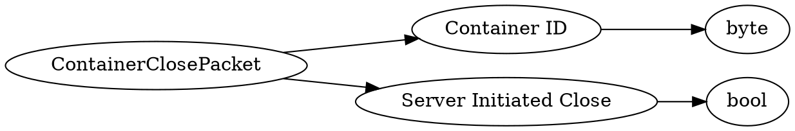

# <!-- md:samp ContainerClosePacket -->

> 文档版本：r/20_u7 协议版本：662

<!-- md:samp ContainerClosePacket -->数据包，数字ID是`47`。

## 结构

## 字段

/// define
ContainerClosePacket

Container ID：<!-- md:samp byte -->

- 类型：byte。enumeration: ContainerID

Server Initiated Close：<!-- md:samp bool -->

- 类型：bool。True if the server initiated the closing

///
