# <!-- md:samp CraftingDataPacket -->

> 文档版本：r/20_u7 协议版本：662

<!-- md:samp CraftingDataPacket -->数据包，数字ID是`52`。

## 结构

```dot
digraph CraftingDataPacket {
	graph [rankdir=LR];
	{
		graph [rank=max];
		3	[comment="name: \"unsigned varint\", typeName: \"\", id: 3, branchId: 0, recurseId: -1, attributes: 512, notes: \"\"",
			label="unsigned varint"];
		6	[comment="name: \"CraftingDataEntry\", typeName: \"\", id: 6, branchId: 0, recurseId: -1, attributes: 512, notes: \"\"",
			label=CraftingDataEntry];
		9	[comment="name: \"unsigned varint\", typeName: \"\", id: 9, branchId: 0, recurseId: -1, attributes: 512, notes: \"\"",
			label="unsigned varint"];
		25	[comment="name: \"PotionMixDataEntry\", typeName: \"\", id: 25, branchId: 0, recurseId: -1, attributes: 512, notes: \"\"",
			label=PotionMixDataEntry];
		28	[comment="name: \"unsigned varint\", typeName: \"\", id: 28, branchId: 0, recurseId: -1, attributes: 512, notes: \"\"",
			label="unsigned varint"];
		38	[comment="name: \"ContainerMixDataEntry\", typeName: \"\", id: 38, branchId: 0, recurseId: -1, attributes: 512, notes: \"\"",
			label=ContainerMixDataEntry];
		41	[comment="name: \"unsigned varint\", typeName: \"\", id: 41, branchId: 0, recurseId: -1, attributes: 512, notes: \"\"",
			label="unsigned varint"];
		55	[comment="name: \"MaterialReducerDataEntry\", typeName: \"\", id: 55, branchId: 0, recurseId: -1, attributes: 512, notes: \"\"",
			label=MaterialReducerDataEntry];
		57	[comment="name: \"bool\", typeName: \"\", id: 57, branchId: 0, recurseId: -1, attributes: 512, notes: \"\"",
			label=bool];
	}
	0	[comment="name: \"CraftingDataPacket\", typeName: \"\", id: 0, branchId: 52, recurseId: -1, attributes: 0, notes: \"\"",
		label=CraftingDataPacket];
	1	[comment="name: \"Crafting Entries\", typeName: \"\", id: 1, branchId: 0, recurseId: -1, attributes: 8, notes: \"\"",
		label="Crafting Entries"];
	0 -> 1;
	7	[comment="name: \"Potion Mixes\", typeName: \"\", id: 7, branchId: 0, recurseId: -1, attributes: 8, notes: \"\"",
		label="Potion Mixes"];
	0 -> 7;
	26	[comment="name: \"Container Mixes\", typeName: \"\", id: 26, branchId: 0, recurseId: -1, attributes: 8, notes: \"\"",
		label="Container Mixes"];
	0 -> 26;
	39	[comment="name: \"Material Reducers\", typeName: \"\", id: 39, branchId: 0, recurseId: -1, attributes: 8, notes: \"\"",
		label="Material Reducers"];
	0 -> 39;
	56	[comment="name: \"Clear Recipes\", typeName: \"\", id: 56, branchId: 0, recurseId: -1, attributes: 0, notes: \"\"",
		label="Clear Recipes"];
	0 -> 56;
	2	[comment="name: \"Array Size\", typeName: \"\", id: 2, branchId: 0, recurseId: -1, attributes: 0, notes: \"\"",
		label="Array Size"];
	1 -> 2;
	4	[comment="name: \"example element\", typeName: \"\", id: 4, branchId: 0, recurseId: -1, attributes: 16, notes: \"\"",
		label="example element",
		style=dotted];
	1 -> 4;
	2 -> 3;
	5	[comment="name: \"Crafting Entry\", typeName: \"CraftingDataEntry\", id: 5, branchId: 0, recurseId: -1, attributes: 256, notes: \"\"",
		label="Crafting Entry"];
	4 -> 5;
	5 -> 6;
	8	[comment="name: \"Array Size\", typeName: \"\", id: 8, branchId: 0, recurseId: -1, attributes: 0, notes: \"\"",
		label="Array Size"];
	7 -> 8;
	10	[comment="name: \"example element\", typeName: \"\", id: 10, branchId: 0, recurseId: -1, attributes: 16, notes: \"\"",
		label="example element",
		style=dotted];
	7 -> 10;
	8 -> 9;
	11	[comment="name: \"Potion Mix Entry\", typeName: \"PotionMixDataEntry\", id: 11, branchId: 0, recurseId: -1, attributes: 256, notes: \"\"",
		label="Potion Mix Entry"];
	10 -> 11;
	11 -> 25;
	27	[comment="name: \"Array Size\", typeName: \"\", id: 27, branchId: 0, recurseId: -1, attributes: 0, notes: \"\"",
		label="Array Size"];
	26 -> 27;
	29	[comment="name: \"example element\", typeName: \"\", id: 29, branchId: 0, recurseId: -1, attributes: 16, notes: \"\"",
		label="example element",
		style=dotted];
	26 -> 29;
	27 -> 28;
	30	[comment="name: \"Container Mix Entry\", typeName: \"ContainerMixDataEntry\", id: 30, branchId: 0, recurseId: -1, attributes: 256, notes: \"\"",
		label="Container Mix Entry"];
	29 -> 30;
	30 -> 38;
	40	[comment="name: \"Array Size\", typeName: \"\", id: 40, branchId: 0, recurseId: -1, attributes: 0, notes: \"\"",
		label="Array Size"];
	39 -> 40;
	42	[comment="name: \"example element\", typeName: \"\", id: 42, branchId: 0, recurseId: -1, attributes: 16, notes: \"\"",
		label="example element",
		style=dotted];
	39 -> 42;
	40 -> 41;
	43	[comment="name: \"Material Reducer Entry\", typeName: \"MaterialReducerDataEntry\", id: 43, branchId: 0, recurseId: -1, attributes: 256, notes: \"\"",
		label="Material Reducer Entry"];
	42 -> 43;
	43 -> 55;
	56 -> 57;
}

```

## 字段

/// define
CraftingDataPacket

Crafting Entries

Crafting Entries数组的大小：<!-- md:samp unsigned varint -->

- 类型：unsigned varint。

Crafting Entries的示例元素

Crafting Entry：[<!-- md:samp CraftingDataEntry -->](refs/protocols/types/CraftingDataEntry.md)

- 类型：CraftingDataEntry。

Potion Mixes

Potion Mixes数组的大小：<!-- md:samp unsigned varint -->

- 类型：unsigned varint。

Potion Mixes的示例元素

Potion Mix Entry：[<!-- md:samp PotionMixDataEntry -->](refs/protocols/types/PotionMixDataEntry.md)

- 类型：PotionMixDataEntry。

Container Mixes

Container Mixes数组的大小：<!-- md:samp unsigned varint -->

- 类型：unsigned varint。

Container Mixes的示例元素

Container Mix Entry：[<!-- md:samp ContainerMixDataEntry -->](refs/protocols/types/ContainerMixDataEntry.md)

- 类型：ContainerMixDataEntry。

Material Reducers

Material Reducers数组的大小：<!-- md:samp unsigned varint -->

- 类型：unsigned varint。

Material Reducers的示例元素

Material Reducer Entry：[<!-- md:samp MaterialReducerDataEntry -->](refs/protocols/types/MaterialReducerDataEntry.md)

- 类型：MaterialReducerDataEntry。

Clear Recipes：<!-- md:samp bool -->

- 类型：bool。

///
