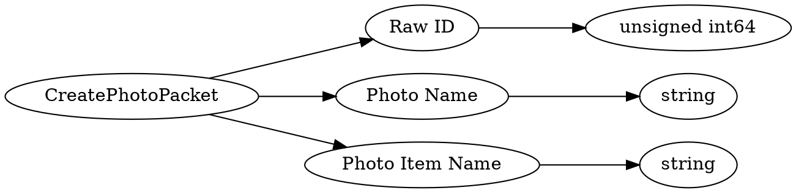

# <!-- md:samp CreatePhotoPacket -->

> 文档版本：r/20_u7 协议版本：662

<!-- md:samp CreatePhotoPacket -->数据包，数字ID是`171`。

## 结构

## 字段

/// define
CreatePhotoPacket

Raw ID：<!-- md:samp unsigned int64 -->

- 类型：unsigned int64。

Photo Name：<!-- md:samp string -->

- 类型：string。

Photo Item Name：<!-- md:samp string -->

- 类型：string。

///
