# <!-- md:samp CreativeContentPacket -->

> 文档版本：r/20_u7 协议版本：662

<!-- md:samp CreativeContentPacket -->数据包，数字ID是`145`。

## 结构

```dot
digraph CreativeContentPacket {
	graph [rankdir=LR];
	{
		graph [rank=max];
		3	[comment="name: \"unsigned varint\", typeName: \"\", id: 3, branchId: 0, recurseId: -1, attributes: 512, notes: \"\"",
			label="unsigned varint"];
		9	[comment="name: \"TypedServerNetId<struct CreativeItemNetIdTag,unsigned int,0>\", typeName: \"\", id: 9, branchId: 0, recurseId: -1, attributes: \
512, notes: \"\"",
			label="TypedServerNetId<struct CreativeItemNetIdTag,unsigned int,0>"];
		11	[comment="name: \"NetworkItemInstanceDescriptor\", typeName: \"\", id: 11, branchId: 0, recurseId: -1, attributes: 512, notes: \"\"",
			label=NetworkItemInstanceDescriptor];
	}
	0	[comment="name: \"CreativeContentPacket\", typeName: \"\", id: 0, branchId: 145, recurseId: -1, attributes: 0, notes: \"\"",
		label=CreativeContentPacket];
	1	[comment="name: \"Write Entries\", typeName: \"\", id: 1, branchId: 0, recurseId: -1, attributes: 8, notes: \"\"",
		label="Write Entries"];
	0 -> 1;
	2	[comment="name: \"Array Size\", typeName: \"\", id: 2, branchId: 0, recurseId: -1, attributes: 0, notes: \"\"",
		label="Array Size"];
	1 -> 2;
	4	[comment="name: \"example element\", typeName: \"\", id: 4, branchId: 0, recurseId: -1, attributes: 16, notes: \"\"",
		label="example element",
		style=dotted];
	1 -> 4;
	2 -> 3;
	5	[comment="name: \"Creative Net Id\", typeName: \"TypedServerNetId<struct CreativeItemNetIdTag,unsigned int,0>\", id: 5, branchId: 0, recurseId: \
-1, attributes: 256, notes: \"\"",
		label="Creative Net Id"];
	4 -> 5;
	10	[comment="name: \"Item Instance\", typeName: \"NetworkItemInstanceDescriptor\", id: 10, branchId: 0, recurseId: -1, attributes: 256, notes: \"\"",
		label="Item Instance"];
	4 -> 10;
	5 -> 9;
	10 -> 11;
}

```

## 字段

/// define
CreativeContentPacket

Write Entries

Write Entries数组的大小：<!-- md:samp unsigned varint -->

- 类型：unsigned varint。

Write Entries的示例元素

Creative Net Id：[<!-- md:samp TypedServerNetId<struct CreativeItemNetIdTag,unsigned int,0> -->](refs/protocols/types/TypedServerNetId<struct CreativeItemNetIdTag,unsigned int,0>.md)

- 类型：TypedServerNetId<struct CreativeItemNetIdTag,unsigned int,0>。

Item Instance：[<!-- md:samp NetworkItemInstanceDescriptor -->](refs/protocols/types/NetworkItemInstanceDescriptor.md)

- 类型：NetworkItemInstanceDescriptor。

///
