# <!-- md:samp DimensionDataPacket -->

> 文档版本：r/20_u7 协议版本：662

<!-- md:samp DimensionDataPacket -->数据包，数字ID是`180`。

## 结构

```dot
digraph DimensionDataPacket {
	graph [rankdir=LR];
	{
		graph [rank=max];
		18	[comment="name: \"DimensionDefinitionGroup\", typeName: \"\", id: 18, branchId: 0, recurseId: -1, attributes: 512, notes: \"\"",
			label=DimensionDefinitionGroup];
	}
	0	[comment="name: \"DimensionDataPacket\", typeName: \"\", id: 0, branchId: 180, recurseId: -1, attributes: 0, notes: \"\"",
		label=DimensionDataPacket];
	1	[comment="name: \"Dimension Definition Group\", typeName: \"DimensionDefinitionGroup\", id: 1, branchId: 0, recurseId: -1, attributes: 256, notes: \"\"",
		label="Dimension Definition Group"];
	0 -> 1;
	1 -> 18;
}

```

## 字段

/// define
DimensionDataPacket

Dimension Definition Group：[<!-- md:samp DimensionDefinitionGroup -->](refs/protocols/types/DimensionDefinitionGroup.md)

- 类型：DimensionDefinitionGroup。

///
