# <!-- md:samp EduUriResourcePacket -->

> 文档版本：r/20_u7 协议版本：662

<!-- md:samp EduUriResourcePacket -->数据包，数字ID是`170`。

## 结构

```dot
digraph EduUriResourcePacket {
	graph [rankdir=LR];
	{
		graph [rank=max];
		2	[comment="name: \"EduSharedUriResource\", typeName: \"\", id: 2, branchId: 0, recurseId: -1, attributes: 512, notes: \"\"",
			label=EduSharedUriResource];
	}
	0	[comment="name: \"EduUriResourcePacket\", typeName: \"\", id: 0, branchId: 170, recurseId: -1, attributes: 0, notes: \"\"",
		label=EduUriResourcePacket];
	1	[comment="name: \"Edu Shared URI Resource\", typeName: \"EduSharedUriResource\", id: 1, branchId: 0, recurseId: -1, attributes: 256, notes: \"\"",
		label="Edu Shared URI Resource"];
	0 -> 1;
	1 -> 2;
}

```

## 字段

/// define
EduUriResourcePacket

Edu Shared URI Resource：[<!-- md:samp EduSharedUriResource -->](refs/protocols/types/EduSharedUriResource.md)

- 类型：EduSharedUriResource。

///
