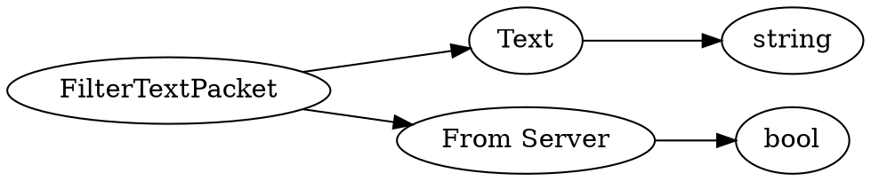

# <!-- md:samp FilterTextPacket -->

> 文档版本：r/20_u7 协议版本：662

<!-- md:samp FilterTextPacket -->数据包，数字ID是`163`。

## 结构

## 字段

/// define
FilterTextPacket

Text：<!-- md:samp string -->

- 类型：string。

From Server：<!-- md:samp bool -->

- 类型：bool。Whether this message is a filtered string from the server or a string in need of filtering from the client

///
