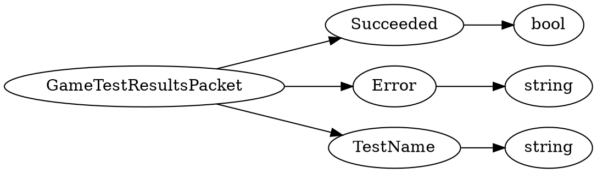

# <!-- md:samp GameTestResultsPacket -->

> 文档版本：r/20_u7 协议版本：662

<!-- md:samp GameTestResultsPacket -->数据包，数字ID是`195`。

## 结构

## 字段

/// define
GameTestResultsPacket

Succeeded：<!-- md:samp bool -->

- 类型：bool。

Error：<!-- md:samp string -->

- 类型：string。

TestName：<!-- md:samp string -->

- 类型：string。

///
