# <!-- md:samp ItemStackResponsePacket -->

> 文档版本：r/20_u7 协议版本：662

<!-- md:samp ItemStackResponsePacket -->数据包，数字ID是`148`。

## 结构

```dot
digraph ItemStackResponsePacket {
	graph [rankdir=LR];
	{
		graph [rank=max];
		3	[comment="name: \"unsigned varint\", typeName: \"\", id: 3, branchId: 0, recurseId: -1, attributes: 512, notes: \"\"",
			label="unsigned varint"];
		46	[comment="name: \"ItemStackResponseInfo\", typeName: \"\", id: 46, branchId: 0, recurseId: -1, attributes: 512, notes: \"\"",
			label=ItemStackResponseInfo];
	}
	0	[comment="name: \"ItemStackResponsePacket\", typeName: \"\", id: 0, branchId: 148, recurseId: -1, attributes: 0, notes: \"\"",
		label=ItemStackResponsePacket];
	1	[comment="name: \"Responses\", typeName: \"\", id: 1, branchId: 0, recurseId: -1, attributes: 8, notes: \"\"",
		label=Responses];
	0 -> 1;
	2	[comment="name: \"Array Size\", typeName: \"\", id: 2, branchId: 0, recurseId: -1, attributes: 0, notes: \"\"",
		label="Array Size"];
	1 -> 2;
	4	[comment="name: \"example element\", typeName: \"\", id: 4, branchId: 0, recurseId: -1, attributes: 16, notes: \"\"",
		label="example element",
		style=dotted];
	1 -> 4;
	2 -> 3;
	5	[comment="name: \"Response Info\", typeName: \"ItemStackResponseInfo\", id: 5, branchId: 0, recurseId: -1, attributes: 256, notes: \"\"",
		label="Response Info"];
	4 -> 5;
	5 -> 46;
}

```

## 字段

/// define
ItemStackResponsePacket

Responses

Responses数组的大小：<!-- md:samp unsigned varint -->

- 类型：unsigned varint。

Responses的示例元素

Response Info：[<!-- md:samp ItemStackResponseInfo -->](refs/protocols/types/ItemStackResponseInfo.md)

- 类型：ItemStackResponseInfo。

///
