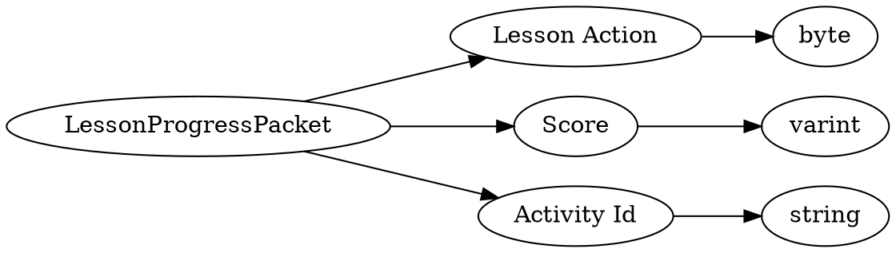

# <!-- md:samp LessonProgressPacket -->

> 文档版本：r/20_u7 协议版本：662

<!-- md:samp LessonProgressPacket -->数据包，数字ID是`183`。

## 结构

## 字段

/// define
LessonProgressPacket

Lesson Action：<!-- md:samp byte -->

- 类型：byte。enumeration: LessonAction

Score：<!-- md:samp varint -->

- 类型：varint。

Activity Id：<!-- md:samp string -->

- 类型：string。

///
