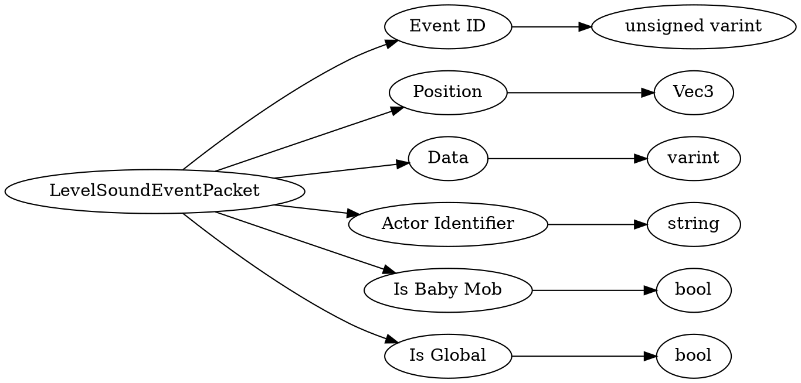

# <!-- md:samp LevelSoundEventPacket -->

> 文档版本：r/20_u7 协议版本：662

<!-- md:samp LevelSoundEventPacket -->数据包，数字ID是`123`。

## 结构

## 字段

/// define
LevelSoundEventPacket

Event ID：<!-- md:samp unsigned varint -->

- 类型：unsigned varint。enumeration: Puv::Legacy::LevelSoundEvent

Position：[<!-- md:samp Vec3 -->](refs/protocols/types/Vec3.md)

- 类型：Vec3。

Data：<!-- md:samp varint -->

- 类型：varint。

Actor Identifier：<!-- md:samp string -->

- 类型：string。

Is Baby Mob：<!-- md:samp bool -->

- 类型：bool。

Is Global：<!-- md:samp bool -->

- 类型：bool。

///
