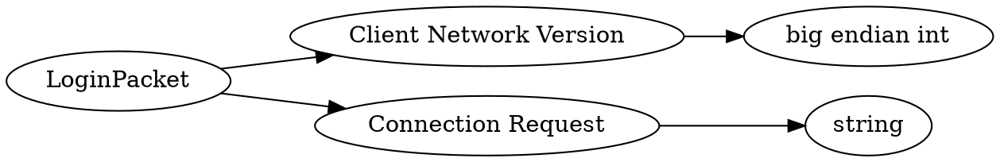

# <!-- md:samp LoginPacket -->

> 文档版本：r/20_u7 协议版本：662

<!-- md:samp LoginPacket -->数据包，数字ID是`1`。

## 结构

## 字段

/// define
LoginPacket

Client Network Version：<!-- md:samp big endian int -->

- 类型：big endian int。

Connection Request：<!-- md:samp string -->

- 类型：string。see @connectionRequest.html#diagram@

///
