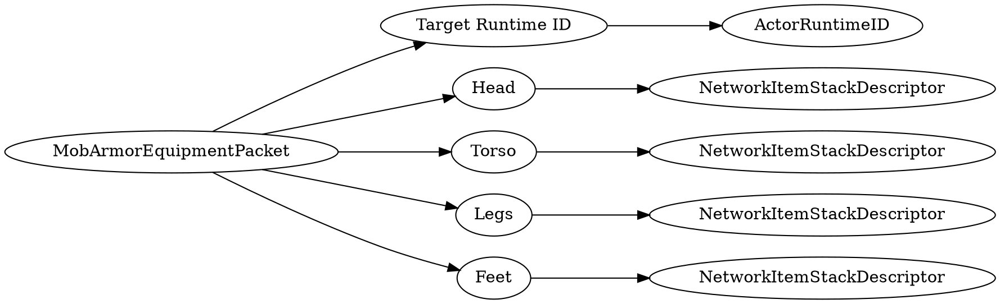

# <!-- md:samp MobArmorEquipmentPacket -->

> 文档版本：r/20_u7 协议版本：662

<!-- md:samp MobArmorEquipmentPacket -->数据包，数字ID是`32`。

## 结构

## 字段

/// define
MobArmorEquipmentPacket

Target Runtime ID：[<!-- md:samp ActorRuntimeID -->](refs/protocols/types/ActorRuntimeID.md)

- 类型：ActorRuntimeID。

Head：[<!-- md:samp NetworkItemStackDescriptor -->](refs/protocols/types/NetworkItemStackDescriptor.md)

- 类型：NetworkItemStackDescriptor。

Torso：[<!-- md:samp NetworkItemStackDescriptor -->](refs/protocols/types/NetworkItemStackDescriptor.md)

- 类型：NetworkItemStackDescriptor。

Legs：[<!-- md:samp NetworkItemStackDescriptor -->](refs/protocols/types/NetworkItemStackDescriptor.md)

- 类型：NetworkItemStackDescriptor。

Feet：[<!-- md:samp NetworkItemStackDescriptor -->](refs/protocols/types/NetworkItemStackDescriptor.md)

- 类型：NetworkItemStackDescriptor。

///
