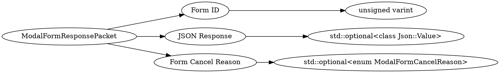

# <!-- md:samp ModalFormResponsePacket -->

> 文档版本：r/20_u7 协议版本：662

<!-- md:samp ModalFormResponsePacket -->数据包，数字ID是`101`。

## 结构

## 字段

/// define
ModalFormResponsePacket

Form ID：<!-- md:samp unsigned varint -->

- 类型：unsigned varint。

JSON Response：[<!-- md:samp std::optional<class Json::Value> -->](refs/protocols/types/std::optional<class Json::Value>.md)

- 类型：std::optional<class Json::Value>。

Form Cancel Reason：[<!-- md:samp std::optional<enum ModalFormCancelReason> -->](refs/protocols/types/std::optional<enum ModalFormCancelReason>.md)

- 类型：std::optional<enum ModalFormCancelReason>。

///
