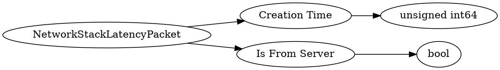

# <!-- md:samp NetworkStackLatencyPacket -->

> 文档版本：r/20_u7 协议版本：662

<!-- md:samp NetworkStackLatencyPacket -->数据包，数字ID是`115`。

## 结构

## 字段

/// define
NetworkStackLatencyPacket

Creation Time：<!-- md:samp unsigned int64 -->

- 类型：unsigned int64。

Is From Server：<!-- md:samp bool -->

- 类型：bool。

///
