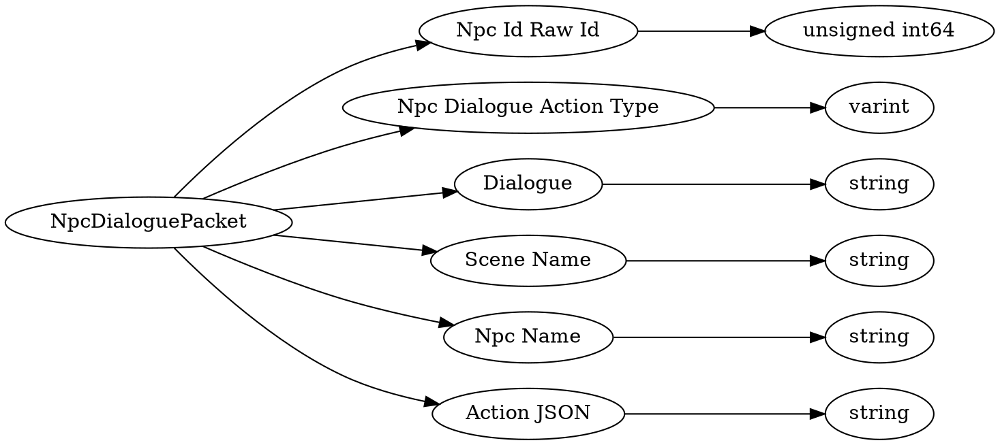

# <!-- md:samp NpcDialoguePacket -->

> 文档版本：r/20_u7 协议版本：662

<!-- md:samp NpcDialoguePacket -->数据包，数字ID是`169`。

## 结构

## 字段

/// define
NpcDialoguePacket

Npc Id Raw Id：<!-- md:samp unsigned int64 -->

- 类型：unsigned int64。The ActorUniqueID of the NPC being remote fired

Npc Dialogue Action Type：<!-- md:samp varint -->

- 类型：varint。enumeration: NpcDialoguePacket::NpcDialogueActionType

Dialogue：<!-- md:samp string -->

- 类型：string。The text to be displayed to the client

Scene Name：<!-- md:samp string -->

- 类型：string。The scene the data has been pulled from for the client to reference

Npc Name：<!-- md:samp string -->

- 类型：string。The 'name' of the NPC to be displayed to the client

Action JSON：<!-- md:samp string -->

- 类型：string。The JSON string of the buttons/actions the server can perform. The server is still authoritative on what actions can be performed

///
