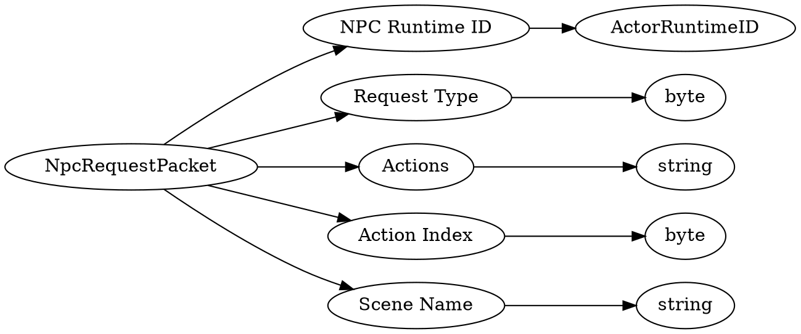

# <!-- md:samp NpcRequestPacket -->

> 文档版本：r/20_u7 协议版本：662

<!-- md:samp NpcRequestPacket -->数据包，数字ID是`98`。

## 结构

## 字段

/// define
NpcRequestPacket

NPC Runtime ID：[<!-- md:samp ActorRuntimeID -->](refs/protocols/types/ActorRuntimeID.md)

- 类型：ActorRuntimeID。

Request Type：<!-- md:samp byte -->

- 类型：byte。enumeration: NpcRequestPacket::RequestType

Actions：<!-- md:samp string -->

- 类型：string。

Action Index：<!-- md:samp byte -->

- 类型：byte。

Scene Name：<!-- md:samp string -->

- 类型：string。

///
