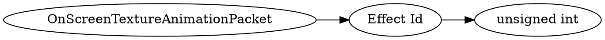

# <!-- md:samp OnScreenTextureAnimationPacket -->

> 文档版本：r/20_u7 协议版本：662

<!-- md:samp OnScreenTextureAnimationPacket -->数据包，数字ID是`130`。

## 结构

## 字段

/// define
OnScreenTextureAnimationPacket

Effect Id：<!-- md:samp unsigned int -->

- 类型：unsigned int。Id of the effect whose icon should be shown on-screen.

///
