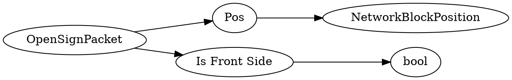

# <!-- md:samp OpenSignPacket -->

> 文档版本：r/20_u7 协议版本：662

<!-- md:samp OpenSignPacket -->数据包，数字ID是`303`。

## 结构

## 字段

/// define
OpenSignPacket

Pos：[<!-- md:samp NetworkBlockPosition -->](refs/protocols/types/NetworkBlockPosition.md)

- 类型：NetworkBlockPosition。

Is Front Side：<!-- md:samp bool -->

- 类型：bool。

///
