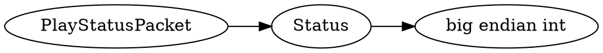

# <!-- md:samp PlayStatusPacket -->

> 文档版本：r/20_u7 协议版本：662

<!-- md:samp PlayStatusPacket -->数据包，数字ID是`2`。

## 结构

## 字段

/// define
PlayStatusPacket

Status：<!-- md:samp big endian int -->

- 类型：big endian int。enumeration: PlayStatus

///
