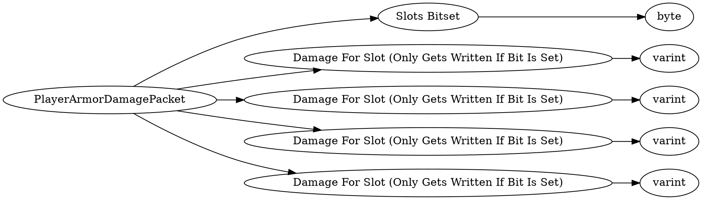

# <!-- md:samp PlayerArmorDamagePacket -->

> 文档版本：r/20_u7 协议版本：662

<!-- md:samp PlayerArmorDamagePacket -->数据包，数字ID是`149`。

## 结构

## 字段

/// define
PlayerArmorDamagePacket

Slots Bitset：<!-- md:samp byte -->

- 类型：byte。

Damage For Slot (Only Gets Written If Bit Is Set)：<!-- md:samp varint -->

- 类型：varint。

///
