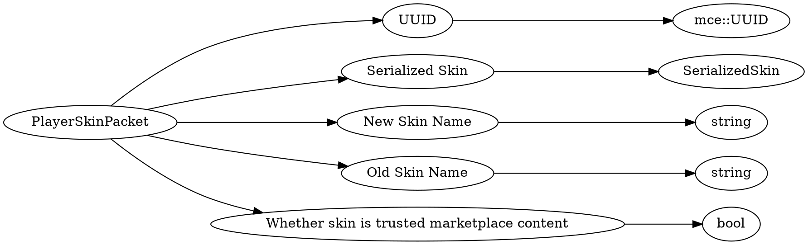

# <!-- md:samp PlayerSkinPacket -->

> 文档版本：r/20_u7 协议版本：662

<!-- md:samp PlayerSkinPacket -->数据包，数字ID是`93`。

## 结构

## 字段

/// define
PlayerSkinPacket

UUID：[<!-- md:samp mce::UUID -->](refs/protocols/types/mce::UUID.md)

- 类型：mce::UUID。

Serialized Skin：[<!-- md:samp SerializedSkin -->](refs/protocols/types/SerializedSkin.md)

- 类型：SerializedSkin。

New Skin Name：<!-- md:samp string -->

- 类型：string。

Old Skin Name：<!-- md:samp string -->

- 类型：string。

Whether skin is trusted marketplace content：<!-- md:samp bool -->

- 类型：bool。

///
