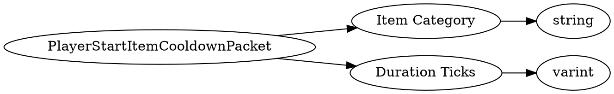

# <!-- md:samp PlayerStartItemCooldownPacket -->

> 文档版本：r/20_u7 协议版本：662

<!-- md:samp PlayerStartItemCooldownPacket -->数据包，数字ID是`176`。

## 结构

## 字段

/// define
PlayerStartItemCooldownPacket

Item Category：<!-- md:samp string -->

- 类型：string。

Duration Ticks：<!-- md:samp varint -->

- 类型：varint。

///
