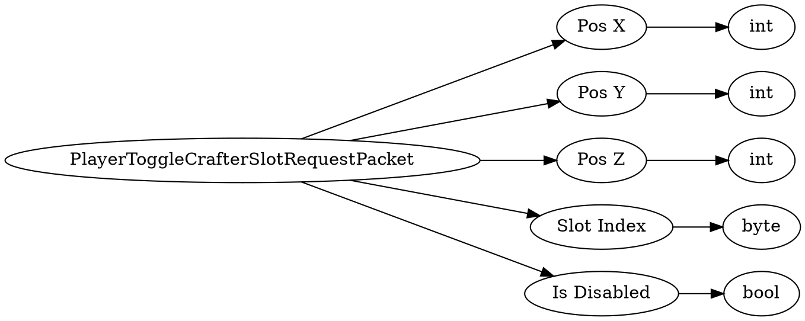

# <!-- md:samp PlayerToggleCrafterSlotRequestPacket -->

> 文档版本：r/20_u7 协议版本：662

<!-- md:samp PlayerToggleCrafterSlotRequestPacket -->数据包，数字ID是`306`。

## 结构

## 字段

/// define
PlayerToggleCrafterSlotRequestPacket

Pos X：<!-- md:samp int -->

- 类型：int。

Pos Y：<!-- md:samp int -->

- 类型：int。

Pos Z：<!-- md:samp int -->

- 类型：int。

Slot Index：<!-- md:samp byte -->

- 类型：byte。

Is Disabled：<!-- md:samp bool -->

- 类型：bool。

///
