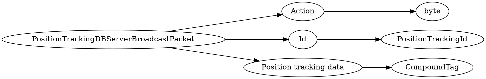

# <!-- md:samp PositionTrackingDBServerBroadcastPacket -->

> 文档版本：r/20_u7 协议版本：662

<!-- md:samp PositionTrackingDBServerBroadcastPacket -->数据包，数字ID是`153`。

## 结构

## 字段

/// define
PositionTrackingDBServerBroadcastPacket

Action：<!-- md:samp byte -->

- 类型：byte。enumeration: PositionTrackingDBServerBroadcastPacket::Action

Id：[<!-- md:samp PositionTrackingId -->](refs/protocols/types/PositionTrackingId.md)

- 类型：PositionTrackingId。

Position tracking data：[<!-- md:samp CompoundTag -->](refs/protocols/types/CompoundTag.md)

- 类型：CompoundTag。CompoundTag for record key:version (byte)'id' (string)positions (list of (int, int, int))dimension (int)status (byte, record status enum)

///
