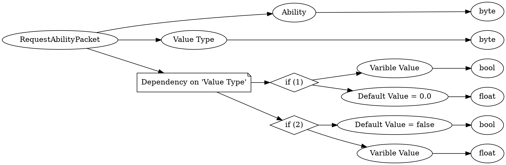

# <!-- md:samp RequestAbilityPacket -->

> 文档版本：r/20_u7 协议版本：662

<!-- md:samp RequestAbilityPacket -->数据包，数字ID是`184`。

## 结构

## 字段

/// define
RequestAbilityPacket

Ability：<!-- md:samp byte -->

- 类型：byte。enumeration: AbilitiesIndex

Value Type：<!-- md:samp byte -->

- 类型：byte。enumeration: RequestAbilityPacket::Type

Dependency on 'Value Type'

//// tab | if (1)
///// define
if (1)

Varible Value：<!-- md:samp bool -->

- 类型：bool。

Default Value = 0.0：<!-- md:samp float -->

- 类型：float。

/////

////

//// tab | if (2)
///// define
if (2)

Default Value = false：<!-- md:samp bool -->

- 类型：bool。

Varible Value：<!-- md:samp float -->

- 类型：float。

/////

////

///
