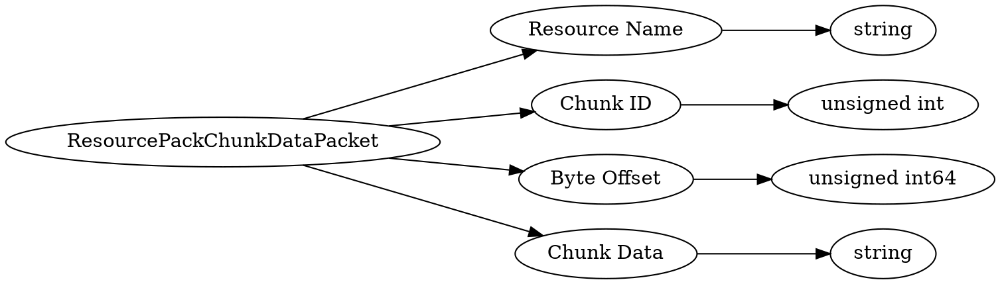

# <!-- md:samp ResourcePackChunkDataPacket -->

> 文档版本：r/20_u7 协议版本：662

<!-- md:samp ResourcePackChunkDataPacket -->数据包，数字ID是`83`。

## 结构

## 字段

/// define
ResourcePackChunkDataPacket

Resource Name：<!-- md:samp string -->

- 类型：string。

Chunk ID：<!-- md:samp unsigned int -->

- 类型：unsigned int。

Byte Offset：<!-- md:samp unsigned int64 -->

- 类型：unsigned int64。

Chunk Data：<!-- md:samp string -->

- 类型：string。

///
