# <!-- md:samp ResourcePackClientResponsePacket -->

> 文档版本：r/20_u7 协议版本：662

<!-- md:samp ResourcePackClientResponsePacket -->数据包，数字ID是`8`。

## 结构

```dot
digraph ResourcePackClientResponsePacket {
	graph [rankdir=LR];
	{
		graph [rank=max];
		2	[comment="name: \"byte\", typeName: \"\", id: 2, branchId: 0, recurseId: -1, attributes: 512, notes: \"\"",
			label=byte];
		5	[comment="name: \"unsigned short\", typeName: \"\", id: 5, branchId: 0, recurseId: -1, attributes: 512, notes: \"\"",
			label="unsigned short"];
		8	[comment="name: \"string\", typeName: \"\", id: 8, branchId: 0, recurseId: -1, attributes: 512, notes: \"\"",
			label=string];
	}
	0	[comment="name: \"ResourcePackClientResponsePacket\", typeName: \"\", id: 0, branchId: 8, recurseId: -1, attributes: 0, notes: \"\"",
		label=ResourcePackClientResponsePacket];
	1	[comment="name: \"Response\", typeName: \"\", id: 1, branchId: 0, recurseId: -1, attributes: 0, notes: \"enumeration: ResourcePackResponse\"",
		label=Response];
	0 -> 1;
	3	[comment="name: \"Downloading Packs\", typeName: \"\", id: 3, branchId: 0, recurseId: -1, attributes: 8, notes: \"\"",
		label="Downloading Packs"];
	0 -> 3;
	1 -> 2;
	4	[comment="name: \"Array Size\", typeName: \"\", id: 4, branchId: 0, recurseId: -1, attributes: 0, notes: \"\"",
		label="Array Size"];
	3 -> 4;
	6	[comment="name: \"example element\", typeName: \"\", id: 6, branchId: 0, recurseId: -1, attributes: 16, notes: \"\"",
		label="example element",
		style=dotted];
	3 -> 6;
	4 -> 5;
	7	[comment="name: \"Pack Name\", typeName: \"\", id: 7, branchId: 0, recurseId: -1, attributes: 0, notes: \"\"",
		label="Pack Name"];
	6 -> 7;
	7 -> 8;
}

```

## 字段

/// define
ResourcePackClientResponsePacket

Response：<!-- md:samp byte -->

- 类型：byte。enumeration: ResourcePackResponse

Downloading Packs

Downloading Packs数组的大小：<!-- md:samp unsigned short -->

- 类型：unsigned short。

Downloading Packs的示例元素

Pack Name：<!-- md:samp string -->

- 类型：string。

///
