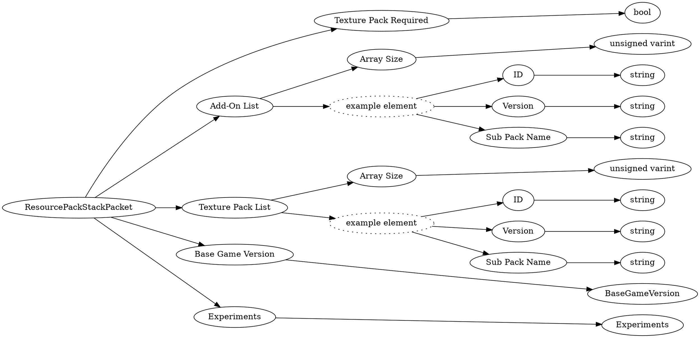

# <!-- md:samp ResourcePackStackPacket -->

> 文档版本：r/20_u7 协议版本：662

<!-- md:samp ResourcePackStackPacket -->数据包，数字ID是`7`。

## 结构

## 字段

/// define
ResourcePackStackPacket

Texture Pack Required：<!-- md:samp bool -->

- 类型：bool。

Add-On List

Add-On List数组的大小：<!-- md:samp unsigned varint -->

- 类型：unsigned varint。

Add-On List的示例元素

ID：<!-- md:samp string -->

- 类型：string。

Version：<!-- md:samp string -->

- 类型：string。

Sub Pack Name：<!-- md:samp string -->

- 类型：string。

Texture Pack List

Texture Pack List数组的大小：<!-- md:samp unsigned varint -->

- 类型：unsigned varint。

Texture Pack List的示例元素

Base Game Version：[<!-- md:samp BaseGameVersion -->](refs/protocols/types/BaseGameVersion.md)

- 类型：BaseGameVersion。For clients to be able to set their stack to the right version.

Experiments：[<!-- md:samp Experiments -->](refs/protocols/types/Experiments.md)

- 类型：Experiments。Refer to the Experiments type for how to serialize

///
