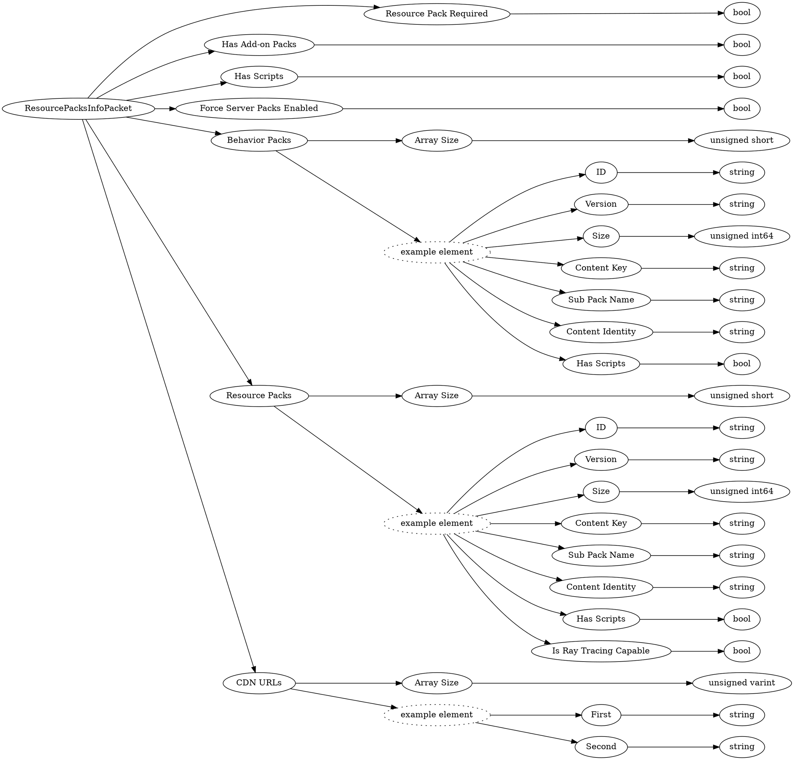

# <!-- md:samp ResourcePacksInfoPacket -->

> 文档版本：r/20_u7 协议版本：662

<!-- md:samp ResourcePacksInfoPacket -->数据包，数字ID是`6`。

## 结构

## 字段

/// define
ResourcePacksInfoPacket

Resource Pack Required：<!-- md:samp bool -->

- 类型：bool。

Has Add-on Packs：<!-- md:samp bool -->

- 类型：bool。

Has Scripts：<!-- md:samp bool -->

- 类型：bool。

Force Server Packs Enabled：<!-- md:samp bool -->

- 类型：bool。

Behavior Packs

Behavior Packs数组的大小：<!-- md:samp unsigned short -->

- 类型：unsigned short。

Behavior Packs的示例元素

ID：<!-- md:samp string -->

- 类型：string。

Version：<!-- md:samp string -->

- 类型：string。

Size：<!-- md:samp unsigned int64 -->

- 类型：unsigned int64。

Content Key：<!-- md:samp string -->

- 类型：string。

Sub Pack Name：<!-- md:samp string -->

- 类型：string。

Content Identity：<!-- md:samp string -->

- 类型：string。

Resource Packs

Resource Packs数组的大小：<!-- md:samp unsigned short -->

- 类型：unsigned short。

Resource Packs的示例元素

Is Ray Tracing Capable：<!-- md:samp bool -->

- 类型：bool。

CDN URLs

CDN URLs数组的大小：<!-- md:samp unsigned varint -->

- 类型：unsigned varint。

CDN URLs的示例元素

First：<!-- md:samp string -->

- 类型：string。

Second：<!-- md:samp string -->

- 类型：string。

///
