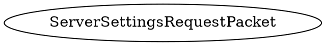

# <!-- md:samp ServerSettingsRequestPacket -->

> 文档版本：r/20_u7 协议版本：662

<!-- md:samp ServerSettingsRequestPacket -->数据包，数字ID是`102`。

## 结构

```dot
digraph ServerSettingsRequestPacket {
	graph [rankdir=LR];
	{
		graph [rank=max];
	}
	0	[comment="name: \"ServerSettingsRequestPacket\", typeName: \"\", id: 0, branchId: 102, recurseId: -1, attributes: 0, notes: \"\"",
		label=ServerSettingsRequestPacket];
}

```

## 字段

/// define

///
