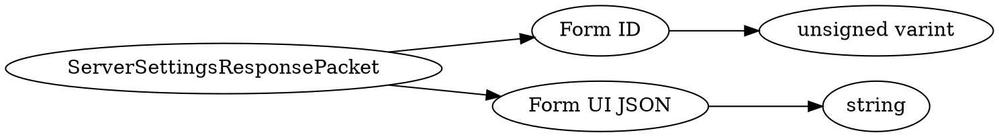

# <!-- md:samp ServerSettingsResponsePacket -->

> 文档版本：r/20_u7 协议版本：662

<!-- md:samp ServerSettingsResponsePacket -->数据包，数字ID是`103`。

## 结构

## 字段

/// define
ServerSettingsResponsePacket

Form ID：<!-- md:samp unsigned varint -->

- 类型：unsigned varint。

Form UI JSON：<!-- md:samp string -->

- 类型：string。

///
