# <!-- md:samp ServerToClientHandshakePacket -->

> 文档版本：r/20_u7 协议版本：662

<!-- md:samp ServerToClientHandshakePacket -->数据包，数字ID是`3`。

## 结构

```dot
digraph ServerToClientHandshakePacket {
	graph [rankdir=LR];
	{
		graph [rank=max];
		2	[comment="name: \"string\", typeName: \"\", id: 2, branchId: 0, recurseId: -1, attributes: 512, notes: \"\"",
			label=string];
	}
	0	[comment="name: \"ServerToClientHandshakePacket\", typeName: \"\", id: 0, branchId: 3, recurseId: -1, attributes: 0, notes: \"\"",
		label=ServerToClientHandshakePacket];
	1	[comment="name: \"Handshake WebToken\", typeName: \"\", id: 1, branchId: 0, recurseId: -1, attributes: 0, notes: \"Base64 encoded JSON Web Token \
that contains the other relevant client properties. roperties Include: salt' = (for use in encryption) he public key used to compute \
the shared secret for encryption is embedded in the header of the token. It's the signer public key (json value of 'x5u')\"",
		label="Handshake WebToken"];
	0 -> 1;
	1 -> 2;
}

```

## 字段

/// define
ServerToClientHandshakePacket

Handshake WebToken：<!-- md:samp string -->

- 类型：string。Base64 encoded JSON Web Token that contains the other relevant client properties. roperties Include: salt' = (for use in encryption) he public key used to compute the shared secret for encryption is embedded in the header of the token. It's the signer public key (json value of 'x5u')

///
