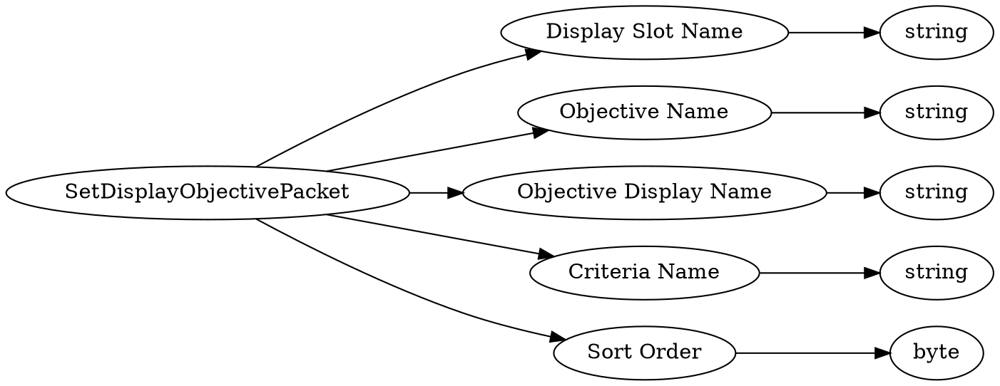

# <!-- md:samp SetDisplayObjectivePacket -->

> 文档版本：r/20_u7 协议版本：662

<!-- md:samp SetDisplayObjectivePacket -->数据包，数字ID是`107`。

## 结构

## 字段

/// define
SetDisplayObjectivePacket

Display Slot Name：<!-- md:samp string -->

- 类型：string。

Objective Name：<!-- md:samp string -->

- 类型：string。

Objective Display Name：<!-- md:samp string -->

- 类型：string。

Criteria Name：<!-- md:samp string -->

- 类型：string。

Sort Order：<!-- md:samp byte -->

- 类型：byte。enumeration: ObjectiveSortOrder

///
