# <!-- md:samp SetScorePacket -->

> 文档版本：r/20_u7 协议版本：662

<!-- md:samp SetScorePacket -->数据包，数字ID是`108`。

## 结构

```dot
digraph SetScorePacket {
	graph [rankdir=LR];
	{
		graph [rank=max];
		2	[comment="name: \"byte\", typeName: \"\", id: 2, branchId: 0, recurseId: -1, attributes: 512, notes: \"\"",
			label=byte];
		5	[comment="name: \"unsigned varint\", typeName: \"\", id: 5, branchId: 0, recurseId: -1, attributes: 512, notes: \"\"",
			label="unsigned varint"];
		11	[comment="name: \"ScoreboardId\", typeName: \"\", id: 11, branchId: 0, recurseId: -1, attributes: 512, notes: \"\"",
			label=ScoreboardId];
		13	[comment="name: \"string\", typeName: \"\", id: 13, branchId: 0, recurseId: -1, attributes: 512, notes: \"\"",
			label=string];
		15	[comment="name: \"int\", typeName: \"\", id: 15, branchId: 0, recurseId: -1, attributes: 512, notes: \"\"",
			label=int];
		18	[comment="name: \"[No Data]\", typeName: \"\", id: 18, branchId: 0, recurseId: -1, attributes: 512, notes: \"\"",
			label="[No Data]"];
		23	[comment="name: \"byte\", typeName: \"\", id: 23, branchId: 0, recurseId: -1, attributes: 512, notes: \"\"",
			label=byte];
		25	[comment="name: \"varint64\", typeName: \"\", id: 25, branchId: 0, recurseId: -1, attributes: 512, notes: \"\"",
			label=varint64];
		28	[comment="name: \"byte\", typeName: \"\", id: 28, branchId: 0, recurseId: -1, attributes: 512, notes: \"\"",
			label=byte];
		30	[comment="name: \"ActorUniqueID\", typeName: \"\", id: 30, branchId: 0, recurseId: -1, attributes: 512, notes: \"\"",
			label=ActorUniqueID];
		33	[comment="name: \"byte\", typeName: \"\", id: 33, branchId: 0, recurseId: -1, attributes: 512, notes: \"\"",
			label=byte];
		35	[comment="name: \"string\", typeName: \"\", id: 35, branchId: 0, recurseId: -1, attributes: 512, notes: \"\"",
			label=string];
	}
	0	[comment="name: \"SetScorePacket\", typeName: \"\", id: 0, branchId: 108, recurseId: -1, attributes: 0, notes: \"\"",
		label=SetScorePacket];
	1	[comment="name: \"Score Packet Type\", typeName: \"\", id: 1, branchId: 0, recurseId: -1, attributes: 0, notes: \"enumeration: ScorePacketType\"",
		label="Score Packet Type"];
	0 -> 1;
	3	[comment="name: \"Score Packet Info\", typeName: \"\", id: 3, branchId: 0, recurseId: -1, attributes: 8, notes: \"\"",
		label="Score Packet Info"];
	0 -> 3;
	1 -> 2;
	4	[comment="name: \"Array Size\", typeName: \"\", id: 4, branchId: 0, recurseId: -1, attributes: 0, notes: \"\"",
		label="Array Size"];
	3 -> 4;
	6	[comment="name: \"example element\", typeName: \"\", id: 6, branchId: 0, recurseId: -1, attributes: 16, notes: \"\"",
		label="example element",
		style=dotted];
	3 -> 6;
	4 -> 5;
	7	[comment="name: \"Id\", typeName: \"ScoreboardId\", id: 7, branchId: 0, recurseId: -1, attributes: 256, notes: \"\"",
		label=Id];
	6 -> 7;
	12	[comment="name: \"Objective Name\", typeName: \"\", id: 12, branchId: 0, recurseId: -1, attributes: 0, notes: \"\"",
		label="Objective Name"];
	6 -> 12;
	14	[comment="name: \"Score Value\", typeName: \"\", id: 14, branchId: 0, recurseId: -1, attributes: 0, notes: \"\"",
		label="Score Value"];
	6 -> 14;
	16	[comment="name: \"Dependency on 'Is Change Type'\", typeName: \"\", id: 16, branchId: 0, recurseId: -1, attributes: 2, notes: \"\"",
		label="Dependency on 'Is Change Type'",
		shape=note];
	6 -> 16;
	7 -> 11;
	12 -> 13;
	14 -> 15;
	17	[comment="name: \"if (0)\", typeName: \"\", id: 17, branchId: 0, recurseId: -1, attributes: 4, notes: \"\"",
		label="if (0)",
		shape=diamond];
	16 -> 17;
	19	[comment="name: \"if (1)\", typeName: \"\", id: 19, branchId: 1, recurseId: -1, attributes: 4, notes: \"\"",
		label="if (1)",
		shape=diamond];
	16 -> 19;
	17 -> 18;
	20	[comment="name: \"Dependency on 'Identity Definition Type'\", typeName: \"\", id: 20, branchId: 0, recurseId: -1, attributes: 2, notes: \"\"",
		label="Dependency on 'Identity Definition Type'",
		shape=note];
	19 -> 20;
	21	[comment="name: \"if (1)\", typeName: \"\", id: 21, branchId: 1, recurseId: -1, attributes: 4, notes: \"\"",
		label="if (1)",
		shape=diamond];
	20 -> 21;
	26	[comment="name: \"if (2)\", typeName: \"\", id: 26, branchId: 2, recurseId: -1, attributes: 4, notes: \"\"",
		label="if (2)",
		shape=diamond];
	20 -> 26;
	31	[comment="name: \"if (3)\", typeName: \"\", id: 31, branchId: 3, recurseId: -1, attributes: 4, notes: \"\"",
		label="if (3)",
		shape=diamond];
	20 -> 31;
	22	[comment="name: \"Identity Definition Type\", typeName: \"\", id: 22, branchId: 0, recurseId: -1, attributes: 0, notes: \"enumeration: IdentityDefinition::\
Type\"",
		label="Identity Definition Type"];
	21 -> 22;
	24	[comment="name: \"Player Unique Id\", typeName: \"\", id: 24, branchId: 0, recurseId: -1, attributes: 0, notes: \"\"",
		label="Player Unique Id"];
	21 -> 24;
	22 -> 23;
	24 -> 25;
	27	[comment="name: \"Identity Definition Type\", typeName: \"\", id: 27, branchId: 0, recurseId: -1, attributes: 0, notes: \"enumeration: IdentityDefinition::\
Type\"",
		label="Identity Definition Type"];
	26 -> 27;
	29	[comment="name: \"Actor Id\", typeName: \"ActorUniqueID\", id: 29, branchId: 0, recurseId: -1, attributes: 256, notes: \"\"",
		label="Actor Id"];
	26 -> 29;
	27 -> 28;
	29 -> 30;
	32	[comment="name: \"Identity Definition Type\", typeName: \"\", id: 32, branchId: 0, recurseId: -1, attributes: 0, notes: \"enumeration: IdentityDefinition::\
Type\"",
		label="Identity Definition Type"];
	31 -> 32;
	34	[comment="name: \"Fake Player Name\", typeName: \"\", id: 34, branchId: 0, recurseId: -1, attributes: 0, notes: \"\"",
		label="Fake Player Name"];
	31 -> 34;
	32 -> 33;
	34 -> 35;
}

```

## 字段

/// define
SetScorePacket

Score Packet Type：<!-- md:samp byte -->

- 类型：byte。enumeration: ScorePacketType

Score Packet Info

Score Packet Info数组的大小：<!-- md:samp unsigned varint -->

- 类型：unsigned varint。

Score Packet Info的示例元素

Id：[<!-- md:samp ScoreboardId -->](refs/protocols/types/ScoreboardId.md)

- 类型：ScoreboardId。

Objective Name：<!-- md:samp string -->

- 类型：string。

Score Value：<!-- md:samp int -->

- 类型：int。

Dependency on 'Is Change Type'

//// tab | if (0)
///// define
if (0)：<!-- md:samp [No Data] -->

- 类型：[No Data]。

/////

////

//// tab | if (1)
///// define
if (1)

Dependency on 'Identity Definition Type'

////// tab | if (1)
/////// define
if (1)

Identity Definition Type：<!-- md:samp byte -->

- 类型：byte。enumeration: IdentityDefinition::Type

Player Unique Id：<!-- md:samp varint64 -->

- 类型：varint64。

///////

//////

////// tab | if (2)
/////// define
if (2)

Identity Definition Type：<!-- md:samp byte -->

- 类型：byte。enumeration: IdentityDefinition::Type

Actor Id：[<!-- md:samp ActorUniqueID -->](refs/protocols/types/ActorUniqueID.md)

- 类型：ActorUniqueID。

///////

//////

////// tab | if (3)
/////// define
if (3)

Identity Definition Type：<!-- md:samp byte -->

- 类型：byte。enumeration: IdentityDefinition::Type

Fake Player Name：<!-- md:samp string -->

- 类型：string。

///////

//////

/////

////

///
