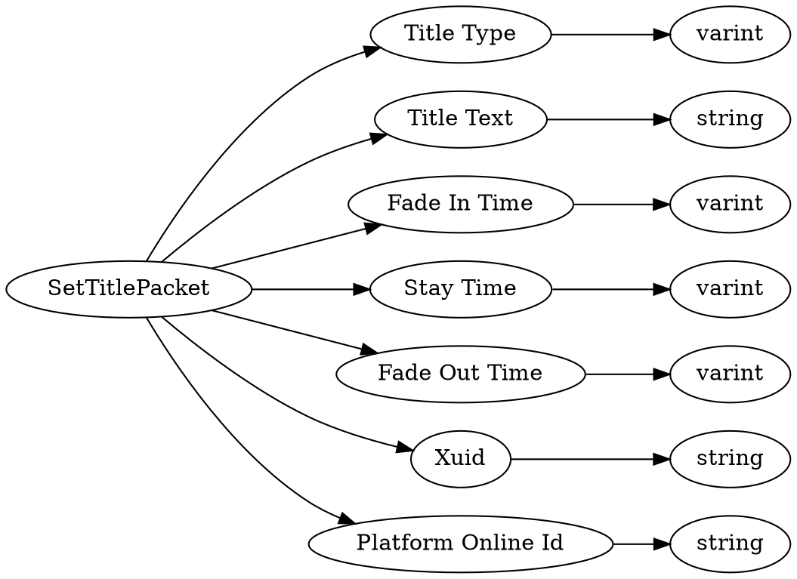

# <!-- md:samp SetTitlePacket -->

> 文档版本：r/20_u7 协议版本：662

<!-- md:samp SetTitlePacket -->数据包，数字ID是`88`。

## 结构

## 字段

/// define
SetTitlePacket

Title Type：<!-- md:samp varint -->

- 类型：varint。enumeration: SetTitlePacket::TitleType

Title Text：<!-- md:samp string -->

- 类型：string。

Fade In Time：<!-- md:samp varint -->

- 类型：varint。

Stay Time：<!-- md:samp varint -->

- 类型：varint。

Fade Out Time：<!-- md:samp varint -->

- 类型：varint。

Xuid：<!-- md:samp string -->

- 类型：string。

Platform Online Id：<!-- md:samp string -->

- 类型：string。

///
