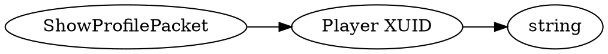

# <!-- md:samp ShowProfilePacket -->

> 文档版本：r/20_u7 协议版本：662

<!-- md:samp ShowProfilePacket -->数据包，数字ID是`104`。

## 结构

## 字段

/// define
ShowProfilePacket

Player XUID：<!-- md:samp string -->

- 类型：string。

///
