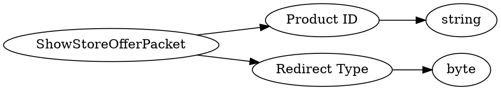

# <!-- md:samp ShowStoreOfferPacket -->

> 文档版本：r/20_u7 协议版本：662

<!-- md:samp ShowStoreOfferPacket -->数据包，数字ID是`91`。

## 结构

## 字段

/// define
ShowStoreOfferPacket

Product ID：<!-- md:samp string -->

- 类型：string。

Redirect Type：<!-- md:samp byte -->

- 类型：byte。enumeration: ShowStoreOfferRedirectType

///
