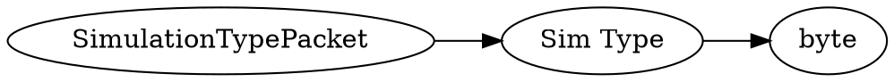

# <!-- md:samp SimulationTypePacket -->

> 文档版本：r/20_u7 协议版本：662

<!-- md:samp SimulationTypePacket -->数据包，数字ID是`168`。

## 结构

## 字段

/// define
SimulationTypePacket

Sim Type：<!-- md:samp byte -->

- 类型：byte。enumeration: SimulationType

///
