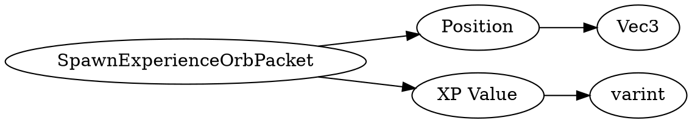

# <!-- md:samp SpawnExperienceOrbPacket -->

> 文档版本：r/20_u7 协议版本：662

<!-- md:samp SpawnExperienceOrbPacket -->数据包，数字ID是`66`。

## 结构

## 字段

/// define
SpawnExperienceOrbPacket

Position：[<!-- md:samp Vec3 -->](refs/protocols/types/Vec3.md)

- 类型：Vec3。

XP Value：<!-- md:samp varint -->

- 类型：varint。

///
