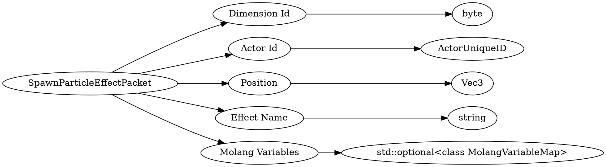

# <!-- md:samp SpawnParticleEffectPacket -->

> 文档版本：r/20_u7 协议版本：662

<!-- md:samp SpawnParticleEffectPacket -->数据包，数字ID是`118`。

## 结构

## 字段

/// define
SpawnParticleEffectPacket

Dimension Id：<!-- md:samp byte -->

- 类型：byte。

Actor Id：[<!-- md:samp ActorUniqueID -->](refs/protocols/types/ActorUniqueID.md)

- 类型：ActorUniqueID。

Position：[<!-- md:samp Vec3 -->](refs/protocols/types/Vec3.md)

- 类型：Vec3。

Effect Name：<!-- md:samp string -->

- 类型：string。Should be an effect that exists on the client. No-op if the effect doesn't exist.

Molang Variables：[<!-- md:samp std::optional<class MolangVariableMap> -->](refs/protocols/types/std::optional<class MolangVariableMap>.md)

- 类型：std::optional<class MolangVariableMap>。

///
