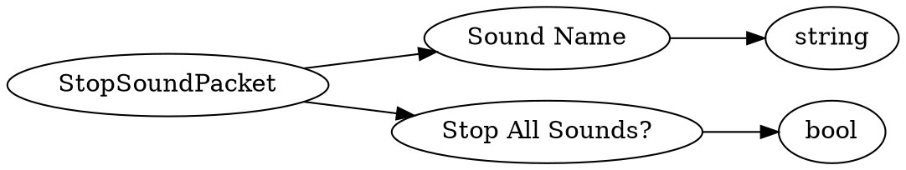

# <!-- md:samp StopSoundPacket -->

> 文档版本：r/20_u7 协议版本：662

<!-- md:samp StopSoundPacket -->数据包，数字ID是`87`。

## 结构

## 字段

/// define
StopSoundPacket

Sound Name：<!-- md:samp string -->

- 类型：string。

Stop All Sounds?：<!-- md:samp bool -->

- 类型：bool。

///
