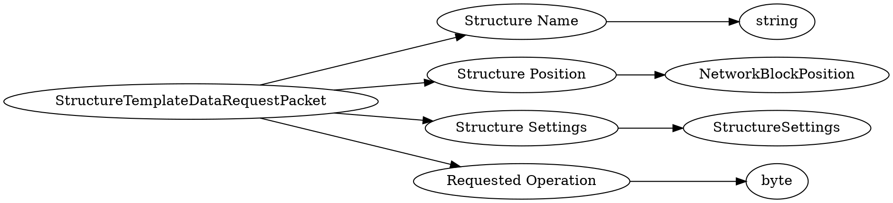

# <!-- md:samp StructureTemplateDataRequestPacket -->

> 文档版本：r/20_u7 协议版本：662

<!-- md:samp StructureTemplateDataRequestPacket -->数据包，数字ID是`132`。

## 结构

## 字段

/// define
StructureTemplateDataRequestPacket

Structure Name：<!-- md:samp string -->

- 类型：string。

Structure Position：[<!-- md:samp NetworkBlockPosition -->](refs/protocols/types/NetworkBlockPosition.md)

- 类型：NetworkBlockPosition。

Structure Settings：[<!-- md:samp StructureSettings -->](refs/protocols/types/StructureSettings.md)

- 类型：StructureSettings。

Requested Operation：<!-- md:samp byte -->

- 类型：byte。enumeration: StructureTemplateRequestOperation

///
