# <!-- md:samp SubChunkRequestPacket -->

> 文档版本：r/20_u7 协议版本：662

<!-- md:samp SubChunkRequestPacket -->数据包，数字ID是`175`。

## 结构

```dot
digraph SubChunkRequestPacket {
	graph [rankdir=LR];
	{
		graph [rank=max];
		2	[comment="name: \"varint\", typeName: \"\", id: 2, branchId: 0, recurseId: -1, attributes: 512, notes: \"\"",
			label=varint];
		4	[comment="name: \"SubChunkPos\", typeName: \"\", id: 4, branchId: 0, recurseId: -1, attributes: 512, notes: \"\"",
			label=SubChunkPos];
		6	[comment="name: \"unsigned int\", typeName: \"\", id: 6, branchId: 0, recurseId: -1, attributes: 512, notes: \"\"",
			label="unsigned int"];
		10	[comment="name: \"SubChunkPacket::SubChunkPosOffset\", typeName: \"\", id: 10, branchId: 0, recurseId: -1, attributes: 512, notes: \"\"",
			label="SubChunkPacket::SubChunkPosOffset"];
	}
	0	[comment="name: \"SubChunkRequestPacket\", typeName: \"\", id: 0, branchId: 175, recurseId: -1, attributes: 0, notes: \"\"",
		label=SubChunkRequestPacket];
	1	[comment="name: \"Dimension Type\", typeName: \"\", id: 1, branchId: 0, recurseId: -1, attributes: 0, notes: \"\"",
		label="Dimension Type"];
	0 -> 1;
	3	[comment="name: \"Center Pos\", typeName: \"SubChunkPos\", id: 3, branchId: 0, recurseId: -1, attributes: 256, notes: \"\"",
		label="Center Pos"];
	0 -> 3;
	5	[comment="name: \"Request Count\", typeName: \"\", id: 5, branchId: 0, recurseId: -1, attributes: 0, notes: \"\"",
		label="Request Count"];
	0 -> 5;
	7	[comment="name: \"SubChunk Pos Offset List\", typeName: \"\", id: 7, branchId: 0, recurseId: -1, attributes: 8, notes: \"\"",
		label="SubChunk Pos Offset List"];
	0 -> 7;
	1 -> 2;
	3 -> 4;
	5 -> 6;
	8	[comment="name: \"example element\", typeName: \"\", id: 8, branchId: 0, recurseId: -1, attributes: 16, notes: \"\"",
		label="example element",
		style=dotted];
	7 -> 8;
	9	[comment="name: \"SubChunk Offset Pos\", typeName: \"SubChunkPacket::SubChunkPosOffset\", id: 9, branchId: 0, recurseId: -1, attributes: 256, \
notes: \"\"",
		label="SubChunk Offset Pos"];
	8 -> 9;
	9 -> 10;
}

```

## 字段

/// define
SubChunkRequestPacket

Dimension Type：<!-- md:samp varint -->

- 类型：varint。

Center Pos：[<!-- md:samp SubChunkPos -->](refs/protocols/types/SubChunkPos.md)

- 类型：SubChunkPos。

Request Count：<!-- md:samp unsigned int -->

- 类型：unsigned int。

SubChunk Pos Offset List

SubChunk Pos Offset List的示例元素

SubChunk Offset Pos：[<!-- md:samp SubChunkPacket::SubChunkPosOffset -->](refs/protocols/types/SubChunkPacket::SubChunkPosOffset.md)

- 类型：SubChunkPacket::SubChunkPosOffset。

///
