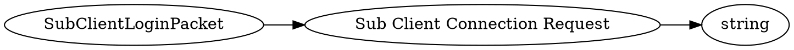

# <!-- md:samp SubClientLoginPacket -->

> 文档版本：r/20_u7 协议版本：662

<!-- md:samp SubClientLoginPacket -->数据包，数字ID是`94`。

## 结构

## 字段

/// define
SubClientLoginPacket

Sub Client Connection Request：<!-- md:samp string -->

- 类型：string。see @subClientConnectionRequest.html#diagram@

///
