# <!-- md:samp SyncActorPropertyPacket -->

> 文档版本：r/20_u7 协议版本：662

<!-- md:samp SyncActorPropertyPacket -->数据包，数字ID是`165`。

## 结构

```dot
digraph SyncActorPropertyPacket {
	graph [rankdir=LR];
	{
		graph [rank=max];
		2	[comment="name: \"CompoundTag\", typeName: \"\", id: 2, branchId: 0, recurseId: -1, attributes: 512, notes: \"\"",
			label=CompoundTag];
	}
	0	[comment="name: \"SyncActorPropertyPacket\", typeName: \"\", id: 0, branchId: 165, recurseId: -1, attributes: 0, notes: \"\"",
		label=SyncActorPropertyPacket];
	1	[comment="name: \"Property Data\", typeName: \"CompoundTag\", id: 1, branchId: 0, recurseId: -1, attributes: 256, notes: \"type: actor identifier \
hash; properties: properties of actor that have been flagged for client sync as a sub-compound tag\"",
		label="Property Data"];
	0 -> 1;
	1 -> 2;
}

```

## 字段

/// define
SyncActorPropertyPacket

Property Data：[<!-- md:samp CompoundTag -->](refs/protocols/types/CompoundTag.md)

- 类型：CompoundTag。type: actor 'id'entifier hash; properties: properties of actor that have been flagged for client sync as a sub-compound tag

///
