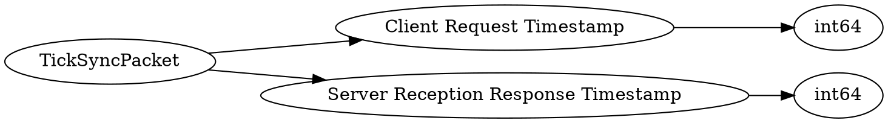

# <!-- md:samp TickSyncPacket -->

> 文档版本：r/20_u7 协议版本：662

<!-- md:samp TickSyncPacket -->数据包，数字ID是`23`。

## 结构

## 字段

/// define
TickSyncPacket

Client Request Timestamp：<!-- md:samp int64 -->

- 类型：int64。

Server Reception Response Timestamp：<!-- md:samp int64 -->

- 类型：int64。

///
