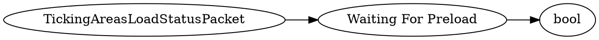

# <!-- md:samp TickingAreasLoadStatusPacket -->

> 文档版本：r/20_u7 协议版本：662

<!-- md:samp TickingAreasLoadStatusPacket -->数据包，数字ID是`179`。

## 结构

## 字段

/// define
TickingAreasLoadStatusPacket

Waiting For Preload：<!-- md:samp bool -->

- 类型：bool。

///
